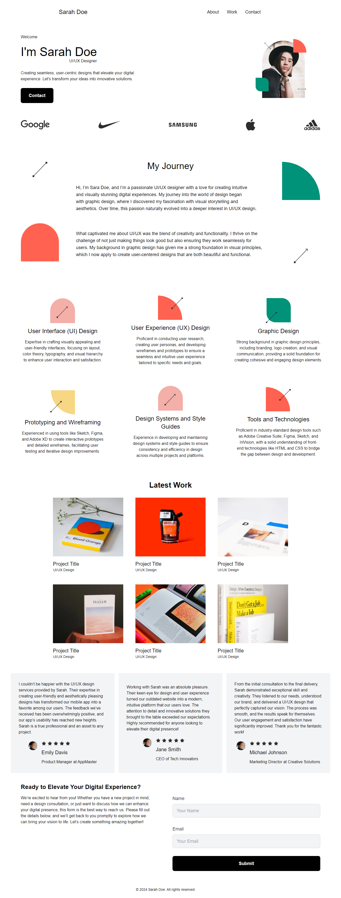

# UI/UX Portfolio Website

Welcome to my UI/UX Portfolio Website, a project I created to showcase my web development skills using Next.js. This portfolio features a fictional client, **Sarah Doe**, whose work and design requirements are used as a template to demonstrate my abilities in creating visually appealing and functional websites.

## Project Overview

This website was built to serve as a portfolio, highlighting various aspects of web development and UI/UX design. It is not only a demonstration of design skills but also a showcase of my expertise in coding, structure, and performance optimization using Next.js.




## Features

- **Responsive Design**: The website is fully responsive, ensuring a seamless user experience across all devices, from desktops to smartphones.
- **Modern UI/UX**: The design focuses on simplicity and usability, with attention to detail in layout, typography, and color schemes.
- **Next.js Framework**: The project leverages the power of Next.js to create a fast, efficient, and scalable website.
- **Dynamic Content**: Content is structured to be easily updatable, with reusable components and a clean, maintainable codebase.

## Tech Stack

- **Next.js**: A powerful React framework that allows for server-side rendering and static site generation, making the website fast and SEO-friendly.
- **React**: The core library for building user interfaces, providing a modular and component-based structure.
- **CSS Modules**: For styling, ensuring that styles are scoped locally and avoiding conflicts.
- **JavaScript (ES6+)**: The backbone of interactivity and dynamic behavior on the site.

## Installation & Setup

To get a local copy of the project up and running, follow these simple steps:

1. **Clone the repository**:
    ```bash
    git clone https://github.com/developmentwithumer/Sarah-Doe-UI-UX-Portfolio.git
    ```

2. **Navigate to the project directory:**
    ```bash
    cd Sarah-Doe-UI-UX-Portfolio
    ```

3. **Install dependencies:**
    ```bash
    npm install
    ```

4. **Run the development server:**
    ```bash
    npm run dev
    ```

    Open http://localhost:3000 in your browser to see the result.

## Usage
This portfolio is designed to be a starting point for those looking to create their own UI/UX portfolio website. Feel free to use it as a template, customize it to suit your needs, or learn from the codebase.

## Contributing
If you have suggestions or improvements, please feel free to open an issue or submit a pull request. Collaboration and feedback are always welcome!

## License
This project is licensed under the MIT License - see the [LICENSE](./LICENSE) file for details.

## Acknowledgments
- **Next.js Documentation:** For providing excellent resources and guides.
- **Open Source Community:** For the inspiration and support.

Thank you for checking out this UI/UX portfolio project of mine! If you have any questions or want to connect, feel free to reach out.